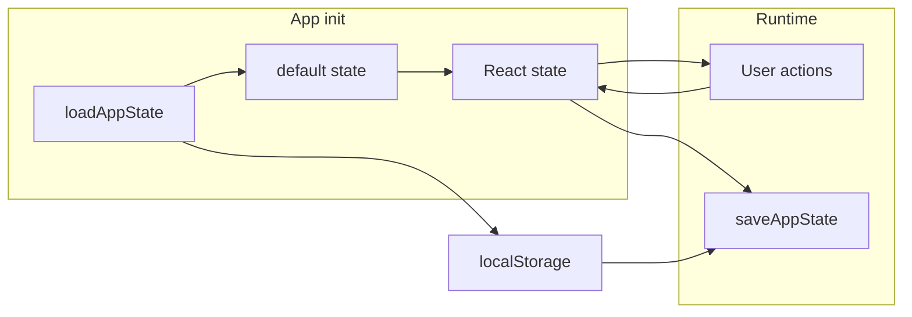

# Browser storage memory – implementation plan

## Current state

- **Already in localStorage:**  
  - Page body HTML: `chit-page-${pageId}` ([editor.tsx](src/components/editor.tsx) load/save).  
  - Toolbar preferences: `chit-font`, `chit-small-text`, `chit-full-width`, `chit-theme` ([page-toolbar.tsx](src/components/page-toolbar.tsx)).
- **Not persisted (lost on refresh):**  
  - Pages list (metadata: id, title, icon, parentId).  
  - Trash.  
  - Active page id (`activeId`).  
  - Next page ID counter (`nextId`).  
  - Sidebar UI: open/peek, expanded folders, trash panel open.

---

## Storage design

Use two localStorage keys to keep responsibilities clear:

| Key                  | Contents                                                                                 |
| -------------------- | ---------------------------------------------------------------------------------------- |
| `chit-app-state`     | `{ pages: Page[], trash: Page[], activeId: string }`                                     |
| `chit-ui` (optional) | `{ sidebarOpen: boolean, sidebarPeek: boolean, expanded: string[], trashOpen: boolean }` |

- **nextId:** Do not store. Derive on load and when creating pages as `1 + max(numeric ids in pages and trash)`, treating non-numeric ids (e.g. `"about-chit"`) as 0 so new IDs stay numeric and never clash.
- **Single source of truth:** Read once on app init from localStorage; all updates go through state and then sync to localStorage (no duplicate reads after init except for migration).

---

## Implementation steps

### 1. Storage helpers

Add a small module (e.g. [src/storage.ts](src/storage.ts)):

- **Constants:** `APP_STATE_KEY = "chit-app-state"`, `UI_STATE_KEY = "chit-ui"`.
- **Types:** `AppState` (pages, trash, activeId), `UIState` (sidebarOpen, sidebarPeek, expanded, trashOpen).
- **Functions:**  
  - `loadAppState(): AppState | null` — `JSON.parse(localStorage.getItem(APP_STATE_KEY))`; return null if missing/invalid.  
  - `saveAppState(state: AppState): void` — `localStorage.setItem(APP_STATE_KEY, JSON.stringify(state))`.  
  - `loadUIState(): UIState | null` and `saveUIState(state: UIState): void` (same pattern).
- **Defaults:** Export default `AppState` (About page + one empty page with id `"1"`, empty trash, activeId `"1"`) and default `UIState` (sidebar closed, no peek, empty expanded, trash closed) for first-run and fallback.

Keep About page HTML initialization as in [App.tsx](src/App.tsx) (lines 46–52): if `chit-page-about-chit` is missing, set it to `ABOUT_HTML`. This stays independent of the new keys.

### 2. App.tsx: load and persist app state

- **Initial state:**  
  - In the `useState` for `pages`/`trash`/`activeId`, call `loadAppState()`. If null, use the current default (About + page `"1"`, empty trash, activeId `"1"`).  
  - Remove the hardcoded `nextId = 2` at module level.
- **nextId derivation:**  
  - Add a helper `getNextId(pages: Page[], trash: Page[]): number` that returns `1 + max(numeric ids)` (parse ids with `parseInt(..., 10)`, ignore NaN and use 0 for non-numeric).  
  - Use this when creating a new page, creating a subpage, restoring from trash (if applicable), and when the last page is deleted and a new empty page is created. Replace every `String(nextId++)` with `String(getNextId(pages, trash))` (or pass a callback that uses current state).
- **Persistence:**  
  - `useEffect` that runs when `pages`, `trash`, or `activeId` change: call `saveAppState({ pages, trash, activeId })`. No debounce needed for this payload size.

Result: pages, trash, and active page are fully restored after refresh; new page IDs stay unique.

### 3. App.tsx: optional UI state (sidebar open/peek)

- **Initial state:**  
  - Initialize `sidebarOpen` and `sidebarPeek` from `loadUIState()` (fallback to current defaults).
- **Persistence:**  
  - When `sidebarOpen` or `sidebarPeek` changes, update a saved UI state: load current `chit-ui`, merge, then `saveUIState`. Alternatively keep a single `useEffect` that saves `{ sidebarOpen, sidebarPeek, expanded: [], trashOpen: false }` until Sidebar is wired (next step).

This keeps “everything” in browser storage; if you prefer to persist only data (no UI), this step can be skipped.

### 4. Sidebar: persist expanded and trashOpen

- **Lift state vs. local read/write:**  
  - Option A (simplest): In [sidebar.tsx](src/components/sidebar.tsx), initialize `expanded` and `trashOpen` from `loadUIState()` (use expanded array and trashOpen; default to empty set and false). On toggle, update state and call `saveUIState` with the new expanded list and trashOpen. No changes to App.  
  - Option B: Lift `expanded` and `trashOpen` to App, pass down and persist in the same `useEffect` that saves `chit-ui`. More refactor, single place for UI persistence.
- **Recommendation:** Option A — Sidebar reads/writes `chit-ui` for `expanded` and `trashOpen` only; App continues to own and persist `sidebarOpen` and `sidebarPeek`. Ensure Sidebar’s save merges with existing `chit-ui` (e.g. load, then `{ ...loaded, expanded, trashOpen }`, then save) so App’s sidebar open/peek and Sidebar’s expanded/trashOpen stay in one key.

Concretely: in Sidebar, replace `useState<Set<string>>(new Set())` with state initialized from `loadUIState()?.expanded` (array → Set) and `useState(false)` for trashOpen from `loadUIState()?.trashOpen`. In the toggle handlers, update state and `saveUIState({ ...loadUIState(), expanded: [...set], trashOpen })`.

### 5. Import flow

- **handleImport:** Already writes `chit-page-${id}` for each new page. New pages are appended to `pages` and state is persisted by the new `useEffect`; no change except that IDs come from `getNextId` instead of `nextId++`.
- **First load / migration:** If `loadAppState()` is null, use default (About + one page). Ensure default pages include the About page and one empty page with id `"1"` so behavior matches current.

### 6. Edge cases

- **Delete last page:** Code already creates a new page with a new id and sets it active. Use `getNextId(remainingPages, trash)` (or current state after delete) for that new page’s id.
- **Restore from trash:** Pages and trash are updated; persistence runs via existing `useEffect`. No extra step.
- **Invalid/corrupt storage:** If `loadAppState()` or `loadUIState()` throws or returns invalid shape, catch and use defaults (same as null).

---

## Data flow (high level)

---

## Files to add/change

- **Add:** [src/storage.ts](src/storage.ts) — keys, types, load/save helpers, default state.
- **Edit:** [src/App.tsx](src/App.tsx) — init from storage, remove module `nextId`, add `getNextId`, persist app state (and optionally sidebar open/peek).
- **Edit:** [src/components/sidebar.tsx](src/components/sidebar.tsx) — init expanded/trashOpen from storage, save on change (merge into `chit-ui`).

No changes to [src/components/editor.tsx](src/components/editor.tsx) (already persists page HTML) or to [src/components/page-toolbar.tsx](src/components/page-toolbar.tsx) (already persists preferences).

---

## Optional / future

- **Debounce:** If you ever persist very large payloads, debounce `saveAppState` (e.g. 300–500 ms) to avoid excessive writes on rapid updates.
- **sessionStorage:** If you want “this tab only” for some state, you could split keys (e.g. app state in localStorage, UI in sessionStorage); not in scope for “everything in browser storage” unless you specify.

If you want to limit scope to “only data, no UI memory”, we can drop steps 3 and 4 and only persist `chit-app-state`.